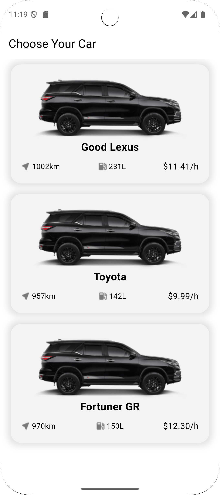
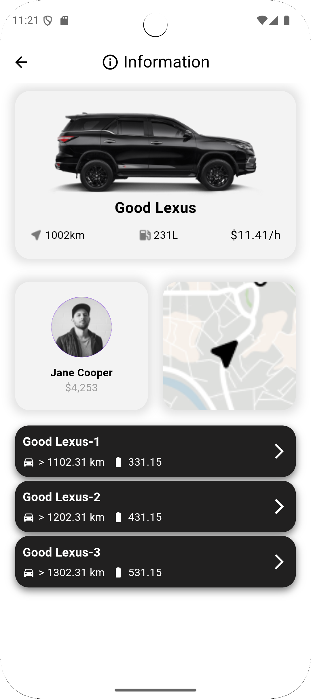
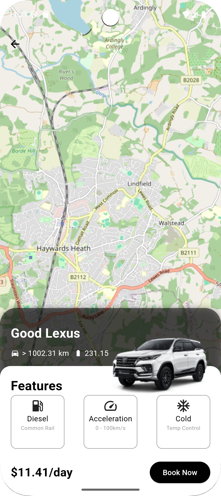

# flutter_car_rental

A car rental app built using the **Clean Architecture** with **BloC**, featuring **OpenStreetMaps** for location-based functionality.

## Features

- Car Details: View detailed information about available cars
- Car Rental Location: View car locations using OpenStreetMaps.

## Screenshots

  
  
  
  

